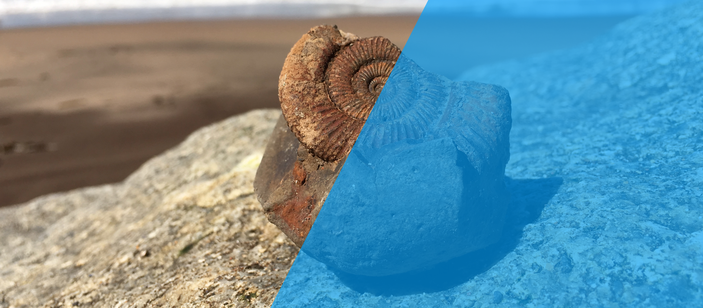

### Hi my name is Dennis 👋
I am a PhD student at the University of Cambridge 🇬🇧 and the British Antarctic Survey where my research is about understanding the processes and pathways of biomineralization in marine invertebrates and their ecological implications. 

**My research interests are broadly about:**
- 🐚 How marine organisms produce shells.
- 🌊 How climate change will influence marine calcifiers.
- 💎 How biominerals can be used to study the oceans of the past.

Please head over to my website if you would like to know more about my research.

## Project Repositories
Here is a non comprehensive list of repositories and code that I used in my reaserach.

- 🐚 [nucella2021world](https://github.com/dm807cam/nucella2021world) - Repository to my research article: **Carbonate system mediated shape shift in intertidal predatory gastropod**

- 🐚 [nucella2021belgium](https://github.com/dm807cam/nucella2021belgium) - Repository to my research article: **Thriving in a changing world: A 130 years shell record of an intertidal predator from the Southern North Sea**

## Packages I built and/or maintain

- 🏋🏼‍♂️ [BodybuildR](https://github.com/dm807cam/BodybuildR) - Fun is fun ;) BodybuildR is a package for fitness enthusiasts to calculate body composition and training intensity in R.  
