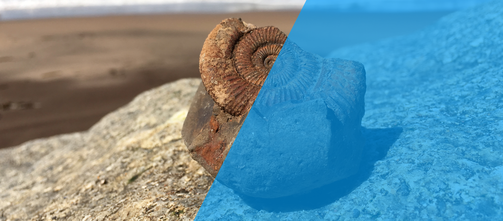

# Hi, I'm Dennis 👋

Some people shoot protists with laser. Others study sea snails. I did both for a while, then decided salaries were also worth a closer look. Job titles have changed a few times; the urge to ask big questions and poke at the data until it answers has not. Still a scientist at heart, just with different specimens.

### The short version

- 🐚 PhD in Earth Sciences from Cambridge — four years spent asking very small molluscs very big questions about climate change
- 📊 Now a Data Scientist, running quantitative compensation analyses across the DACH region (turns out humans are slightly easier to interview than gastropods)
- 📸 Occasional photographer when the light is doing something interesting ([Unsplash](https://unsplash.com/@dm807cam))

### Pet projects

- 🌊 **[Kgen](https://cran.r-project.org/package=kgen)** — a small piece of software with a long backstory: cross-verified equilibrium constants for (palaeo)seawater carbonate chemistry, implemented in R, Python *and* Matlab so that nobody has to argue about whose pH is right.
- 💧 **[reHydrate](https://rehydrate.ink)** — an offline companion for the reMarkable tablet.
- 🟠 **[amber](https://github.com/dm807cam/amber)** — an R package that turns a Shiny app into an actual desktop application. One init_project() call and you get a hardened Electron shell with bundled R, native installers for macOS / Windows / Linux.
