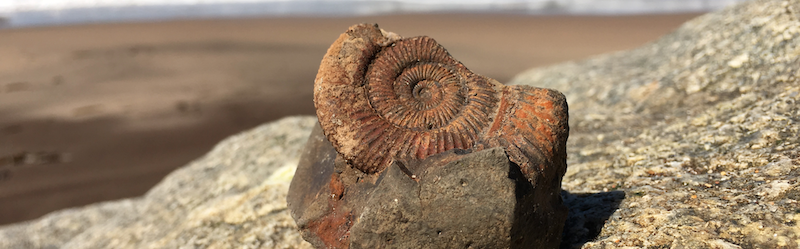

### Hi my name is Dennis 👋
I am a third year PhD student at the University of Cambridge 🇬🇧 and the British Antarctic Survey where my research is about understanding the processes and pathways of biomineralization in marine invertebrates and their ecological implications. 

**My reserach interests are broadly about:**
- 🐚 How marine organisms produce shells.
- 🌊 How climate change will influence marine calcifiers.
- 💎 How biominerals can be used to study the oceans of the past.

